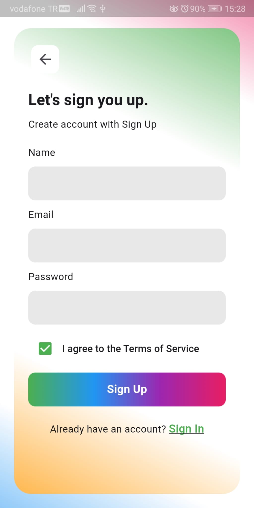

# UI Design Impl

This project focuses on implementing a simple user interface (UI) design for a Flutter application. It aims to provide a basic implementation of the UI elements and layout for the app's screens.

## Views (Screens)

### Sign Up View

Source: [feature/sign_up](./lib/feature/sign_up/sign_up_view.dart)

